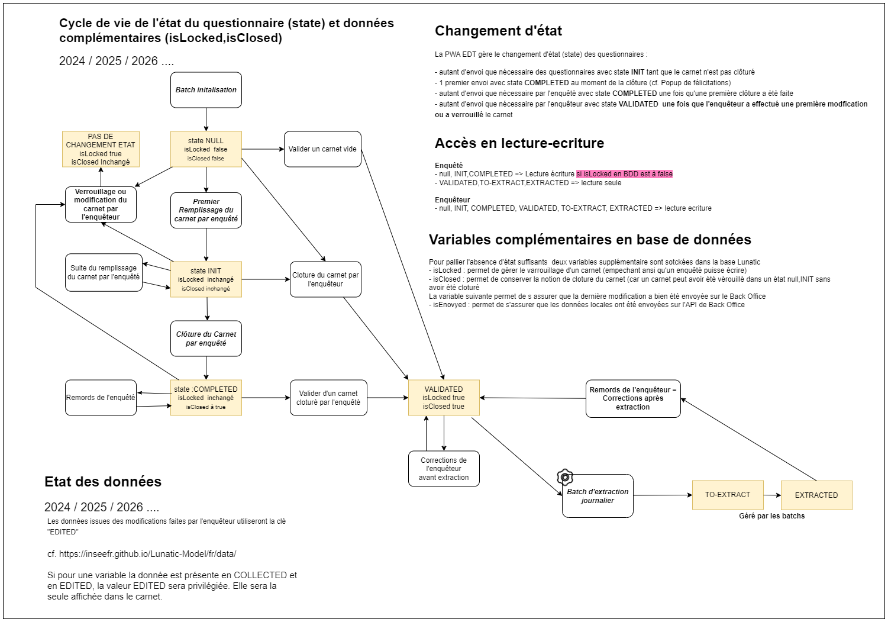
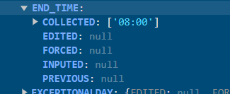
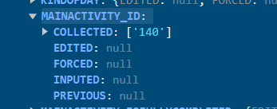

# Technical documentation of Carnet EDT - ReactTS PWA

## General information

EDT is a ReactTS PWA front-end application.
It was made to allow INSEE (French public services) to do surveys based on their own data management and treatment system.
The opensource data engine made by INSEE is called Lunatic.
The most reusable front-end components for any surveys such as input fields have been developped inside another project repository called Lunatic-Edt and is used as a library by EDT.
The app is using the embedded database of the navigator (IndexedDB) and is able to run offline as soon as the app have been loaded once. The user needs internet to login and he will need to recover internet connection at least to deliver his surveys answers when he finished.
EDT is calling two different API.
edt-pilotage API which is used to give to the surveyed their required surveys and surveyers their accessible surveys.
Stromae Back Office API which is used to GET all required nomenclatures for the application such as question answer options. It also allow the user to POST his surveys answers and GET it when he started a survey and then change device.

> Linked repositories :
>
> -   EDT Application : https://github.com/InseeFrLab/edt
> -   Lunatic : https://github.com/InseeFr/Lunatic
> -   Lunatic-EDT : https://github.com/InseeFrLab/lunatic-edt
> -   Edt-pilotage API : https://github.com/InseeFrLab/edt-management-api
> -   Stromae Back Office API : https://github.com/InseeFr/Queen-Back-Office

### Lunatic usage

Lunatic is used by EDT to :

-   Print the questions and associated surveys fields from the lunatic sources provided. In the case of EDT, the sources ids are `edt-activity-survey` and `edt-work-time-survey` (recovered via API call to [Queen Back Office `GET questionnaire/{id}`](#api-queen-back-office)).

<details>
<summary>Source example : </summary>
<br>

```
{
    "pagination": "question",
    "lunaticModelVersion": "2.2.10",
    "modele": "TIME",
    "enoCoreVersion": "2.3.11",
    "generatingDate": "29-09-2022 13:56:00",
    "missing": false,
    "id": "l8lq5lp6",
    "label": "Time",
    "maxPage": "3",
    "variables": [
        {
            "variableType": "COLLECTED",
            "values": {
                "COLLECTED": null,
                "EDITED": null,
                "INPUTED": null,
                "FORCED": null,
                "PREVIOUS": null
            },
            "name": "FIRSTNAME",
            "componentRef": "inputtext_firstName"
        },
        {
            "variableType": "COLLECTED",
            "values": {
                "COLLECTED": null,
                "EDITED": null,
                "INPUTED": null,
                "FORCED": null,
                "PREVIOUS": null
            },
            "name": "SURVEYDATE",
            "componentRef": "datepicker_surveyDate"
        },
        {
            "variableType": "COLLECTED",
            "values": {
                "COLLECTED": [null],
                "EDITED": [null],
                "INPUTED": [null],
                "FORCED": [null],
                "PREVIOUS": [null]
            },
            "name": "WEEKLYPLANNER",
            "componentRef": "weeklyplanner_value"
        },
        {
            "variableType": "COLLECTED",
            "values": {
                "COLLECTED": null,
                "EDITED": null,
                "INPUTED": null,
                "FORCED": null,
                "PREVIOUS": null
            },
            "name": "WEEKTYPE",
            "componentRef": "checkboxone_weektype"
        },
        {
            "variableType": "CALCULATED",
            "expression": "true",
            "name": "FILTER_RESULT_INPUTTEXT",
            "inFilter": "false"
        },
        {
            "variableType": "CALCULATED",
            "expression": "true",
            "name": "FILTER_RESULT_DATEPICKER",
            "inFilter": "false"
        }
    ],
    "components": [
        {
            "componentType": "Sequence",
            "hierarchy": {
                "sequence": { "id": "sequence_1", "page": "1" }
            },
            "conditionFilter": { "value": "true" },
            "id": "sequence_1",
            "page": "1",
            "label": ""
        },
        {
            "componentType": "Input",
            "bindingDependencies": ["FIRSTNAME"],
            "response": { "name": "FIRSTNAME" },
            "hierarchy": {
                "sequence": { "id": "sequence_1", "page": "1" }
            },
            "conditionFilter": { "value": "true" },
            "id": "inputtext_firstName",
            "page": "1",
            "label": "\"Qui êtes-vous ?\"",
            "placeholder": "Prénom",
            "mandatory": true,
            "maxLength": 100,
            "controls": [
                {
                    "criticality": "ERROR",
                    "errorMessage": {
                        "type": "VTL|MD",
                        "value": "\" La valeur doit être remplie.\""
                    },
                    "typeOfControl": "FORMAT",
                    "control": {
                        "type": "VTL",
                        "value": "not(isnull(FIRSTNAME)) and length(FIRSTNAME) >= 1"
                    },
                    "id": "kze792d8-formatBorneInfSup"
                }
            ]
        },
        {
            "componentType": "Datepicker",
            "bindingDependencies": ["SURVEYDATE"],
            "min": "1900-01-01",
            "max": "format-date(current-date(),'[Y0001]-[M01]-[D01]')",
            "dateFormat": "YYYY-MM-DD",
            "response": { "name": "SURVEYDATE" },
            "hierarchy": {
                "sequence": { "id": "sequence_1", "page": "1" }
            },
            "conditionFilter": { "value": "true" },
            "id": "datepicker_surveyDate",
            "page": "2",
            "label": "\"Quel est le premier jour de votre semaine ?\"",
            "mandatory": false,
            "controls": [
                {
                    "criticality": "ERROR",
                    "errorMessage": {
                        "type": "VTL|MD",
                        "value": "\" La valeur doit être remplie.\""
                    },
                    "typeOfControl": "FORMAT",
                    "control": {
                        "type": "VTL",
                        "value": "not(isnull(SURVEYDATE)) and length(SURVEYDATE) >= 1"
                    },
                    "id": "kze792d8-inputSurveyDate"
                }
            ]
        },
        {
            "componentType": "WeeklyPlanner",
            "bindingDependencies": ["WEEKLYPLANNER"],
            "response": {
                "name": "WEEKLYPLANNER"
            },
            "hierarchy": {
                "sequence": {
                    "id": "sequence_1",
                    "page": "1"
                }
            },
            "conditionFilter": {
                "value": "true"
            },
            "id": "weeklyplanner_value",
            "page": "3",
            "mandatory": false,
            "title": "Planning de votre semaine",
            "workSumLabel": "Durée totale travaillée : ",
            "presentButtonLabel": "Continuer",
            "futureButtonLabel": "Commencer"
        },
        {
            "componentType": "CheckboxOneEdt",
            "bindingDependencies": ["WEEKTYPE"],
            "response": { "name": "WEEKTYPE" },
            "hierarchy": {
                "sequence": {
                    "id": "sequence_1",
                    "page": "1"
                }
            },
            "conditionFilter": { "value": "true" },
            "id": "checkboxone_weektype",
            "page": "4",
            "label": "\"De quel type de semaine s’agissait-il ?\"",
            "mandatory": false
        },
        {
            "componentType": "Input",
            "bindingDependencies": ["FIRSTNAME"],
            "response": { "name": "FIRSTNAME" },
            "hierarchy": {
                "sequence": { "id": "sequence_1", "page": "1" }
            },
            "conditionFilter": { "value": "true" },
            "id": "inputtext_firstName2",
            "page": "5",
            "label": "\"Vos informations : \"",
            "placeholder": "Prénom",
            "mandatory": true,
            "maxLength": 100,
            "controls": [
                {
                    "criticality": "ERROR",
                    "errorMessage": {
                        "type": "VTL|MD",
                        "value": "\" Le prénom doit être saisi.\""
                    },
                    "typeOfControl": "FORMAT",
                    "control": {
                        "type": "VTL",
                        "value": "not(isnull(FIRSTNAME)) and length(FIRSTNAME) >= 1"
                    },
                    "id": "kze792d8-formatBornInfSup2"
                }
            ]
        },
        {
            "componentType": "Datepicker",
            "bindingDependencies": ["SURVEYDATE"],
            "min": "1900-01-01",
            "max": "format-date(current-date(),'[Y0001]-[M01]-[D01]')",
            "dateFormat": "YYYY-MM-DD",
            "response": { "name": "SURVEYDATE" },
            "hierarchy": {
                "sequence": { "id": "sequence_1", "page": "1" }
            },
            "conditionFilter": { "value": "true" },
            "id": "datepicker_surveyDate2",
            "page": "5",
            "label": "\"Le premier jour de votre semaine : \"",
            "mandatory": false,
            "controls": [
                {
                    "criticality": "ERROR",
                    "errorMessage": {
                        "type": "VTL|MD",
                        "value": "\" La date doit être saisie.\""
                    },
                    "typeOfControl": "FORMAT",
                    "control": {
                        "type": "VTL",
                        "value": "not(isnull(SURVEYDATE)) and length(SURVEYDATE) >= 1"
                    },
                    "id": "kze792d8-inputSurveyDate2"
                }
            ]
        }
    ]
}

```

</details>
<br>
- Manage the data associated to the surveys fields described in the source.

> For EDT, we did not use Lunatic integrated navigation system because at the time of the development, it was not able to do what was required for this app.
> Thanks to the fact that Lunatic is fast, we integrated an Orchestrator (refer to https://github.com/InseeFr/Lunatic) in each app page, that point directly to the good source page and component. This way, the data and survey questions are manage by standard Lunatic system but all the navigation and persistence system is handled by EDT.

### Lunatic EDT usage

This lib was designed to be integrated in the future inside another MUI reusable components lib of INSEE. This lib being in development at the time of EDT development, Lunatic-EDT was created to accelerate the process.

It contains all the survey "fields" components and an associated storybook documentation (please refer to [Lunatic-EDT local install](#lunatic-edt-local-install) section to launch the storybook).

## Household lifecycle

### Initial survey state

A surveyed, when loggin in the first time, will be able to see le total of the surveys retrieved by the query _REACT_APP_EDT_ORGANISATION_API_BASE_URL + "api/survey-assigment/interviewer/my-surveys"_.

In demo version, the surveys able to see are `REACT_APP_NUM_ACTIVITY_SURVEYS` (total amount of activity surveys, accessible in env file) activity surveys and `REACT_APP_NUM_WORKTIME_SURVEYS` work time surveys.

When a survey has never been started, no data are visible in the indexedDB.

### Started survey state

When a user starts a survey, you can find it in the indexedDB referenced by his surveyId.
You will also find all the labels and values of the variables corresponding to each question answer for this survey and the lunatic source.
The data is sent to INSEE by API call each time a user validate an answer and has access to internet.

### Completed survey state

Corresponding to ISCOMPLETED boolean variable, this state is true when a survey have been fully completed. A user isn't forced to fully complete a survey to be able to send it to INSEE.

## Closed survey state

This state correspond to ISCLOSED boolean variable. This state is set to true when users finishes his survey and reach the submission screen. This value is independant from ISENVOYED variable.

## Sent survey state

Currently corresponding to the ISENVOYED boolean variable. This state is to know if the current survey has been finished by the surveyed and its data has been submitted to INSEE backend.

## Locked survey state

`ISLOCKED` boolean variable is set to true when a surveyer change any of the surveyed data from the surveyer interface or if he locks the survey by using the lock button.
This state is impacting the surveyed rights in the app. Any locked survey is not editable by the surveyed anymore (no more writting rights). The surveyer only can manage this state.

## Validated survey state

This state is visible on the `ISVALIDATED` boolean variable. This state can be set only by the surveyer. When this state is set to true, the ISLOCKED boolean also take true as value. The surveyer can still edit the data, but the surveyed doesn't have writting rights anymore.

Also, the `ISVALIDATED` variable is updated by the value state on state-data when loading data.

## Household surveys state

This information concerns the surveyer interface. A color code have been set to allow surveyers to know what is the household state. The state is defined as follow :

-   Orange : When no survey in the household has the state ISCLOSED to true.
-   Green : When at least one survey in the household has the ISCLOSED state to true.
-   Black : When all surveys in the household have the ISVALIDATED to true.

Those states have been defined to ease the visibility of the ongoing current survey campain for the surveyer.

## Lifecycle state



### Project structure


`src` : Contains all the source code of the application. It also has the 2 surveys sources required by Lunatic and used by EDT.

`assets` : Contains all app assets such as svg icons or fonts.

`components` : Contains two folders. `commons` which has all the components that could be reusable in another app that would work like EDT using Lunatic. `edt` that has all the EDT specific components.

`documentation` : Contains the app technical documentation. Including `LunaticSourceToEdt.xlsx` file that contains the links between the EDT pages, the Lunatic-EDT components used and the sources variables.

`enumerations` : Contains all enumerations of the application.

`i18n` : Contains i18n configuration and `fr.json` which is the file that holds all the app labels including accessility labels.

`interface` : Contains all the Typescript interfaces of the used entities, lunatic models etc...

`orchestrator`: Contains orchestrator, which manages the communication of the app with lunatic, where we recover the Lunatic components, its data, etc.

`pages` : Contains all app pages. The `activity` folder holds the specific pages for the activity survey and `work-time` the ones for the work time survey. Other common pages are directly inside the `pages` folder.

`routes` : Contains `EdtRoutes.tsx` which holds the React BrowserRouter tag and all the navigation routes. `EdtRoutesMapping.ts` is holding the `mappingPageOrchestrator` (refer to the [Enumerations & Maps](#maps) section).

`service` : Contains all the app services. Please refer to the [Services section](#services) for further information.

### Authentification

#### Keycloak

EDT is using a Keycloak for authentification. It uses `oidc-react` (https://github.com/bjerkio/oidc-react) to manage the connection between the Keycloak and the app. You can find the oidc config inside the `src/index.tsx` file.

These two environment variables are used to setup the connection :

```
REACT_APP_KEYCLOAK_AUTHORITY=https://auth.demo.insee.io/auth/realms/questionnaires-edt/
REACT_APP_KEYCLOAK_AUTHORITY_REVIEWER=https://auth.insee.io/auth/realms/questionnaires-particuliers/?kc_idp_hint=insee-ssp
REACT_APP_KEYCLOAK_CLIENT_ID=client-edt
```

The user bearer token is used to call the secured APIs.

The accounts are created and managed by INSEE. It is not possible to sign up by yourself.

SSO is available using INSEE LDAP only with users with reviewer role. The reviewer is already authenticated when we enter with SSO, if he enter the url https://{URL_ENVIRO}/?kc_idp_hint={IDP_ID} (or {IDP_ID} can be no value, defaults "insee-ssp") already authenticated, he is redirect to the main page of the app taking the current token and the information corresponding, without having to go through the authentication page again.

#### Rights

The different roles of the application are defined on the EdtUserRightsEnum enum.


The values of its variables are replaced by the environment variables `REACT_APP_REVIEWER_ROLE` and `REACT_APP_SURVEYED_ROLE` respectively.

The rights check is done on the _getUserRights()_ method so that we always retrieve a value from the _EdtUserRightsEnum_ enum.


### APIs usage

#### Architecture schema


#### API Edt-pilotage

This API is used to GET the surveys ids to which the surveyed or the surveyers have access.

##### Used Endpoints :

`GET /survey-assigment/interviewer/my-surveys` : Get all the survey assigments for an interviewer

<details>
<summary>Answer format</summary>
<br>

```
[
  {
    "id": 0,
    "interviewerId": "string",
    "surveyUnitId": "string",
    "reviewerId": "string",
    "campaignId": "string",
    "questionnaireModelId": "string"
  }
]
```

</details>

##### Dev API swagger :

https://edt-api-kc.demo.insee.io/swagger-ui/index.html

##### Repository :

https://github.com/InseeFrLab/edt-management-api

#### API Queen Back Office

This API is used to GET all required nomenclatures for the application such as question answer options. It also allow the user to POST his surveys answers and GET it when he started a survey and then change device.

##### Used Endpoints :

`GET questionnaire/{id}` : json of survey model (source).

<details>
<summary>Answer format</summary>
<br>

```
{
  "model": {
    "variables": [
      {
        "name": "LAST_BROADCAST",
        "value": null,
        "variableType": "EXTERNAL"
      },
      {
        "name": "COMMENT",
        "responseRef": "COMMENT",
        "variableType": "COLLECTED"
      },
      ...
    ]
  }
}
```

</details>

---

`GET /nomenclature/{id}` : json of nomenclature

<details>
<summary>Answer format</summary>
<br>
    
  ```
[
  {
    "reg": "01",
    "cheflieu": 97105,
    "libelle": "Guadeloupe",
    "tncc": 3,
    "nccenr": "Guadeloupe",
    "ncc": "GUADELOUPE"
  },
  {
    "reg": "02",
    "cheflieu": 97209,
    "libelle": "Martinique",
    "tncc": 3,
    "nccenr": "Martinique",
    "ncc": "MARTINIQUE"
  },
  {
    "reg": "03",
    "cheflieu": 97302,
    "libelle": "Guyane",
    "tncc": 3,
    "nccenr": "Guyane",
    "ncc": "GUYANE"
  },
  ...
]
```  
</details>

---

`GET /survey-unit/{id}` : get a survey unit by id

<details>
<summary>Answer format</summary>
<br>
    
  ```
 {
  "stateData": {
    "state": ENUM ["INIT", "VALIDATED", 
 "TO-EXTRACT","EXTRACTED"]
    "date": Number (milisec since 1/1/1970)
    "currentPage": Integer
  },

"personalization": JsonArray,

"data": JsonObject
}

```
</details>


---

`PUT /survey-unit/{id}` : Edit a survey unit by id


<details>
<summary>Body format</summary>
<br>

```

{
"stateData": {
"state": ENUM ["INIT", "VALIDATED",
"TO-EXTRACT","EXTRACTED"]
"date": Number (milisec since 1/1/1970)
"currentPage": Integer
},

"personalization": JsonArray,

"data": JsonObject
}

```
</details>


##### Dev API swagger :
https://stromae-edt-kc.demo.insee.io/swagger-ui.html

##### Repository :
https://github.com/InseeFr/Queen-Back-Office

## Services
`alert-service.ts` : Used to get alert content.

`api-service.ts` : Contains all API calls.

`loop-service.ts` : Used to handle loop size and loop data to recover the current state of the navigation.

`loop-stepper-service.ts` : Used to get all loop steps data.

`lunatic-database.ts` : Contains database management and functions.

`navigation-service.ts` : Used to hold all navigation functions.

`orchestrator-service.ts` : Used to recover current source and survey.

`referentiel-service.ts` : Contains all the functions to recover data from nomenclature.

`responsive.ts` : Used to know about the current device (tablet, mobile, desktop). It also contains the maximum  width in px to determine which kind of device is in use.

```

const mobileMaxWidth = 767;
const tabletMinWidth = 768;
const tabletMaxWidth = 991;
const destktopMinWidth = 992;

```

`stepper.service.ts` : Holds functions linked to the outside of loop steppers (such as end of survey stepper).

`survey-activity-service.ts` : Contains all the functions linked to the activity survey datas and treatments.

`survey-service.ts` : Contains all the functions that are generic about surveys data and treatments.

## Enumerations & Maps

### Enumerations

 This section contains all the most important enumerations used by the EDT app. These enumerations have to be updated each time the source is edited (new variables, pages, ...)

<details>
<summary>SourcesEnum :</summary>
<br>

```

export enum SourcesEnum {
ACTIVITY_SURVEY = "edt-activity-survey",
WORK_TIME_SURVEY = "edt-work-time-survey",
}

```
</details>
<br>

Usage : this enumeration is used to define the Lunatic sources ids that are used by EDT.

---

<details>
<summary>ReferentielsEnum :</summary>
<br>

```

export enum ReferentielsEnum {
ACTIVITYNOMENCLATURE = "edt-activityCategory",
ACTIVITYAUTOCOMPLETE = "edt-activityAutoComplete",
ROUTE = "edt-route",
ACTIVITYSECONDARYACTIVITY = "edt-activitySecondaryActivity",
ROUTESECONDARYACTIVITY = "edt-routeSecondaryActivity",
LOCATION = "edt-place",
KINDOFWEEK = "edt-kindOfWeek",
KINDOFDAY = "edt-kindOfDay",
}

```
</details>
<br>

Usage : this enumeration is used to define the nomenclature ids that are used by EDT in order to be able to recover it by id from API call (please refer to [Queen Back Office](#api-queen-back-office) section).

---

<details>
<summary>FieldNameEnum :</summary>

```

export enum FieldNameEnum {
LASTNAME = "LASTNAME",
FIRSTNAME = "FIRSTNAME",
SURVEYDATE = "SURVEYDATE",
START_TIME = "START_TIME",
END_TIME = "END_TIME",
MAINACTIVITY_ID = "MAINACTIVITY_ID",
MAINACTIVITY_SUGGESTERID = "MAINACTIVITY_SUGGESTERID",
MAINACTIVITY_ISFULLYCOMPLETED = "MAINACTIVITY_ISFULLYCOMPLETED",
MAINACTIVITY_LABEL = "MAINACTIVITY_LABEL",
INPUT_SUGGESTER = "INPUT_SUGGESTER",
ACTIVITY_SELECTER_HISTORY = "ACTIVITY_SELECTER_HISTORY",
ROUTE = "ROUTE",
GOAL = "GOAL",
WITHSECONDARYACTIVITY = "WITHSECONDARYACTIVITY",
SECONDARYACTIVITY = "SECONDARYACTIVITY",
SECONDARYACTIVITY_LABEL = "SECONDARYACTIVITY_LABEL",
MEANOFTRANSPORT = "MEANOFTRANSPORT",
PLACE = "PLACE",
WITHSOMEONE = "WITHSOMEONE",
COUPLE = "COUPLE",
PARENTS = "PARENTS",
CHILD = "CHILD",
OTHERKNOWN = "OTHERKNOWN",
OTHER = "OTHER",
WITHSCREEN = "WITHSCREEN",
WEEKLYPLANNER = "WEEKLYPLANNER",
WEEKTYPE = "WEEKTYPE",
WORKINGWEEK = "WORKINGWEEK",
HOLIDAYWEEK = "HOLIDAYWEEK",
OTHERWEEK = "OTHERWEEK",
GREATESTACTIVITYDAY = "GREATESTACTIVITYDAY",
WORSTACTIVITYDAY = "WORSTACTIVITYDAY",
KINDOFDAY = "KINDOFDAY",
EXCEPTIONALDAY = "EXCEPTIONALDAY",
TRAVELTIME = "TRAVELTIME",
PHONETIME = "PHONETIME",
ISCLOSED = "ISCLOSED",
ISENVOYED = "ISENVOYED",
ISROUTE = "ISROUTE",
ISCOMPLETED = "ISCOMPLETED",
ISVALIDATED = "ISVALIDATED",
ISLOCKED = "ISLOCKED",
}

```
</details>
<br>

Usage : this enumeration is used to do the link between all the variables from the Lunatic source and the app services.
It is composed of all the variables declared in the `variables` section of the source/s.
In the case of EDT, it contains the variables from `edt-activity-survey` and `edt-work-time-survey`.


---
<details>
<summary>EdtRoutesNameEnum :</summary>
<br>

```

export enum EdtRoutesNameEnum {
INSTALL = "install",
REVIEWER_HOME = "reviewer-home",
REVIEWER_SURVEYS_OVERVIEW = "surveys-overview",
SURVEYED_HOME = "surveyed-home",
HELP = "help",
ERROR = "error/:code",
ACTIVITY = "activity/:idSurvey",
WHO_ARE_YOU = "who-are-you",
DAY_OF_SURVEY = "day-of-survey",
WORK_TIME = "work-time/:idSurvey",
EDIT_GLOBAL_INFORMATION = "edit-global-information",
WEEKLY_PLANNER = "weekly-planner",
KIND_OF_WEEK = "kind-of-week",
ACTIVITY_OR_ROUTE_PLANNER = "activity-or-route-planner",
EDIT_ACTIVITY_INFORMATION = "edit-activity-information/:iteration",
ACTIVITY_DURATION = "activity-duration/:iteration",
MAIN_ACTIVITY = "main-activity/:iteration",
MAIN_ACTIVITY_GOAL = "main-activity-goal/:iteration",
ROUTE = "route/:iteration",
SECONDARY_ACTIVITY = "secondary-activity/:iteration",
SECONDARY_ACTIVITY_SELECTION = "secondary-activity-selection/:iteration",
MEAN_OF_TRANSPORT = "mean-of-transport/:iteration",
ACTIVITY_LOCATION = "activity-location/:iteration",
WITH_SOMEONE = "with-who/:iteration",
WITH_SOMEONE_SELECTION = "with-who-selection/:iteration",
WITH_SCREEN = "with-screen/:iteration",
GREATEST_ACTIVITY_DAY = "greatest-activity-day",
WORST_ACTIVITY_DAY = "worst-activity-day",
KIND_OF_DAY = "kind-of-day",
EXCEPTIONAL_DAY = "exceptional-day",
TRAVEL_TIME = "travel-time",
PHONE_TIME = "phone-time",
END_SURVEY = "end-survey",
ACTIVITY_SUMMARY = "activity-summary",
HELP_INSTALL = "help-install",
HELP_ACTIVITY = "help-activity",
HELP_DURATION = "help-duration",
HELP_MAIN_ACTIVITY_CATEGORY = "help-main-activity-category",
HELP_MAIN_ACTIVITY_SUB_CATEGORY = "help-main-activity-sub-category",
HELP_CHECKBOX = "help-checkbox",
HELP_WORK_TIME = "help-work-time",
}

```
</details>
<br>

Usage : This enumeration contains all the routes used by the app to navigate.


---

### Maps

<details>
<summary>mappingPageOrchestrator :</summary>
<br>

```

let mappingPageOrchestrator: OrchestratorEdtNavigation[] = [
{
parentPage: EdtRoutesNameEnum.ACTIVITY,
page: EdtRoutesNameEnum.WHO_ARE_YOU,
surveySource: "activity-survey.json",
surveyPage: "1",
},
{
parentPage: EdtRoutesNameEnum.ACTIVITY,
page: EdtRoutesNameEnum.DAY_OF_SURVEY,
surveySource: "activity-survey.json",
surveyPage: "2",
},
{
parentPage: EdtRoutesNameEnum.ACTIVITY,
page: EdtRoutesNameEnum.ACTIVITY_OR_ROUTE_PLANNER,
surveySource: "activity-survey.json",
surveyPage: "3",
},
{
parentPage: EdtRoutesNameEnum.ACTIVITY_OR_ROUTE_PLANNER,
page: EdtRoutesNameEnum.ACTIVITY_DURATION,
surveySource: "activity-survey.json",
surveyPage: getLoopInitialPage(LoopEnum.ACTIVITY_OR_ROUTE),
surveySubPage: "2",
surveyStep: 1,
},
{
parentPage: EdtRoutesNameEnum.ACTIVITY_OR_ROUTE_PLANNER,
page: EdtRoutesNameEnum.MAIN_ACTIVITY,
surveySource: "activity-survey.json",
surveyPage: getLoopInitialPage(LoopEnum.ACTIVITY_OR_ROUTE),
surveySubPage: "3",
surveyStep: 2,
},
{
parentPage: EdtRoutesNameEnum.ACTIVITY_OR_ROUTE_PLANNER,
page: EdtRoutesNameEnum.ROUTE,
surveySource: "activity-survey.json",
surveyPage: getLoopInitialPage(LoopEnum.ACTIVITY_OR_ROUTE),
surveySubPage: "4",
surveyStep: 2,
},
{
parentPage: EdtRoutesNameEnum.ACTIVITY_OR_ROUTE_PLANNER,
page: EdtRoutesNameEnum.MEAN_OF_TRANSPORT,
surveySource: "activity-survey.json",
surveyPage: getLoopInitialPage(LoopEnum.ACTIVITY_OR_ROUTE),
surveySubPage: "5",
surveyStep: 3,
},
{
parentPage: EdtRoutesNameEnum.ACTIVITY_OR_ROUTE_PLANNER,
page: EdtRoutesNameEnum.SECONDARY_ACTIVITY,
surveySource: "activity-survey.json",
surveyPage: getLoopInitialPage(LoopEnum.ACTIVITY_OR_ROUTE),
surveySubPage: "6",
surveyStep: 3,
},
{
parentPage: EdtRoutesNameEnum.ACTIVITY_OR_ROUTE_PLANNER,
page: EdtRoutesNameEnum.ACTIVITY_LOCATION,
surveySource: "activity-survey.json",
surveyPage: getLoopInitialPage(LoopEnum.ACTIVITY_OR_ROUTE),
surveySubPage: "7",
surveyStep: 4,
},
{
parentPage: EdtRoutesNameEnum.ACTIVITY_OR_ROUTE_PLANNER,
page: EdtRoutesNameEnum.WITH_SOMEONE,
surveySource: "activity-survey.json",
surveyPage: getLoopInitialPage(LoopEnum.ACTIVITY_OR_ROUTE),
surveySubPage: "8",
surveyStep: 5,
},
{
parentPage: EdtRoutesNameEnum.ACTIVITY_OR_ROUTE_PLANNER,
page: EdtRoutesNameEnum.WITH_SCREEN,
surveySource: "activity-survey.json",
surveyPage: getLoopInitialPage(LoopEnum.ACTIVITY_OR_ROUTE),
surveySubPage: "9",
surveyStep: 6,
},
{
parentPage: EdtRoutesNameEnum.ACTIVITY_OR_ROUTE_PLANNER,
page: EdtRoutesNameEnum.MAIN_ACTIVITY_GOAL,
surveySource: "activity-survey.json",
surveyPage: getLoopInitialPage(LoopEnum.ACTIVITY_OR_ROUTE),
surveySubPage: "10",
surveyStep: 2,
},
{
parentPage: EdtRoutesNameEnum.ACTIVITY_OR_ROUTE_PLANNER,
page: EdtRoutesNameEnum.SECONDARY_ACTIVITY_SELECTION,
surveySource: "activity-survey.json",
surveyPage: getLoopInitialPage(LoopEnum.ACTIVITY_OR_ROUTE),
surveySubPage: "11",
surveyStep: 3,
},
{
parentPage: EdtRoutesNameEnum.ACTIVITY_OR_ROUTE_PLANNER,
page: EdtRoutesNameEnum.WITH_SOMEONE_SELECTION,
surveySource: "activity-survey.json",
surveyPage: getLoopInitialPage(LoopEnum.ACTIVITY_OR_ROUTE),
surveySubPage: "12",
surveyStep: 5,
},
{
parentPage: EdtRoutesNameEnum.ACTIVITY,
page: EdtRoutesNameEnum.GREATEST_ACTIVITY_DAY,
surveySource: "activity-survey.json",
surveyPage: "5",
},
{
parentPage: EdtRoutesNameEnum.ACTIVITY,
page: EdtRoutesNameEnum.WORST_ACTIVITY_DAY,
surveySource: "activity-survey.json",
surveyPage: "6",
},
{
parentPage: EdtRoutesNameEnum.ACTIVITY,
page: EdtRoutesNameEnum.KIND_OF_DAY,
surveySource: "activity-survey.json",
surveyPage: "7",
},
{
parentPage: EdtRoutesNameEnum.ACTIVITY,
page: EdtRoutesNameEnum.EXCEPTIONAL_DAY,
surveySource: "activity-survey.json",
surveyPage: "8",
},
{
parentPage: EdtRoutesNameEnum.ACTIVITY,
page: EdtRoutesNameEnum.TRAVEL_TIME,
surveySource: "activity-survey.json",
surveyPage: "9",
},
{
parentPage: EdtRoutesNameEnum.ACTIVITY,
page: EdtRoutesNameEnum.PHONE_TIME,
surveySource: "activity-survey.json",
surveyPage: "10",
},
{
parentPage: EdtRoutesNameEnum.ACTIVITY,
page: EdtRoutesNameEnum.EDIT_GLOBAL_INFORMATION,
surveySource: "activity-survey.json",
surveyPage: "3",
},
{
parentPage: EdtRoutesNameEnum.WORK_TIME,
page: EdtRoutesNameEnum.WHO_ARE_YOU,
surveySource: "work-time-survey.json",
surveyPage: "1",
},
{
parentPage: EdtRoutesNameEnum.WORK_TIME,
page: EdtRoutesNameEnum.DAY_OF_SURVEY,
surveySource: "work-time-survey.json",
surveyPage: "2",
},
{
parentPage: EdtRoutesNameEnum.WORK_TIME,
page: EdtRoutesNameEnum.WEEKLY_PLANNER,
surveySource: "work-time-survey.json",
surveyPage: "3",
},
{
parentPage: EdtRoutesNameEnum.WORK_TIME,
page: EdtRoutesNameEnum.KIND_OF_WEEK,
surveySource: "work-time-survey.json",
surveyPage: "4",
},
{
parentPage: EdtRoutesNameEnum.WORK_TIME,
page: EdtRoutesNameEnum.EDIT_GLOBAL_INFORMATION,
surveySource: "work-time-survey.json",
surveyPage: "5",
},
];

```
</details>
<br>

Usage : This map is used to do the link between the Lunatic source and the app navigation.

### Environment variables

EDT is using `react-script` default environment variables system. Please refer to https://create-react-app.dev/docs/adding-custom-environment-variables/ to know more about it.

The `.env.development` file is used when EDT is compiled in local.
The `.env.production` file is used when the builded app is hosted.

<details>
<summary>.env.production file</summary>
<br>

```

REACT_APP_STROMAE_BACK_OFFICE_API_BASE_URL=https://stromae-edt-kc.demo.insee.io/
REACT_APP_EDT_ORGANISATION_API_BASE_URL=https://edt-api-kc.demo.insee.io/
REACT_APP_KEYCLOAK_AUTHORITY=https://auth.demo.insee.io/auth/realms/questionnaires-edt/
REACT_APP_KEYCLOAK_AUTHORITY_REVIEWER=https://auth.insee.io/auth/realms/questionnaires-particuliers/
REACT_APP_KEYCLOAK_CLIENT_ID=client-edt
REACT_APP_KEYCLOAK_REDIRECT_URI=https://insee-recette-edt.k8s.keyconsulting.fr/
REACT_APP_HOUSE_REFERENCE_REGULAR_EXPRESSION=.\$
REACT_APP_SEPARATOR_SUGGESTER=;
REACT_APP_NODE_ENV="production"
REACT_APP_CHROMIUM_PATH=/builds/insee/edt/deploy/pwa-edt/node_modules/chromium/lib/chromium/chrome-linux/chrome
REACT_APP_NUM_ACTIVITY_SURVEYS=6
REACT_APP_NUM_WORKTIME_SURVEYS=2

```
</details>

`REACT_APP_NUM_ACTIVITY_SURVEYS` and `REACT_APP_NUM_WORKTIME_SURVEYS` allows to change the surveys affichées pour le mode demo.

Otherwise, the number of surveys displayed are retrieved by the request *"REACT_APP_EDT_ORGANISATION_API_BASE_URL + api/survey-assigment/interviewer/my-surveys"* or the distinction on each model is made from the variable *questionnaireModelId*.


## Orchestrator


Orchestrator manages the communication of the app with lunatic, where we recover the Lunatic components, its data, etc.

Currently the application manages access modes (profiles): interviewer mode and reviewer mode which can save and consult data.

​The app manages the two modes using the different properties that exist in the database, for each variable.
For each variable, there are 5 usable properties: **COLLECTED, EDITED, FORCED, INPUTED, PREVIOUS**. In this app, we will use the **COLLECTED** property for the **interviewer mode** and the **EDITED** property for the **reviewer mode**.

Normally, the management of persistence modes is done on the lunatic side, unfortunately the current version that we use on the app does not take this option into account. To resolve this problem, we managed the recovery of data from the orchestrator.

### Updated variables

The orchestrator is summoned on each page of the application where we have displayed a lunatic component.

For each lunatic component, we have several variables attached. Each time we enter the corresponding page, we modify the corresponding variables; if we do not enter this page, no modification is made to the variables.

For example, for the creation of an activity, on the page for choosing a main activity (main_activity), we have attached the lunatic component "activity_selecter" and on this component we have the variables: **"MAINACTIVITY_ID", "MAINACTIVITY_SUGGESTERID" , "MAINACTIVITY_LABEL", "MAINACTIVITY_ISFULLYCOMPLETED", "INPUT_SUGGESTER", "ACTIVITY_SELECTER_HISTORY"**.

So, if you create an activity, when you arrive on the main_activity page, the values for these variables are updated, so we add a value to the array or we modify the corresponding value.
If you create an activity, but get to the previous step, you will never modify the values of these variables.
Even if you create a path, it never passes through this component, so we cannot modify the values.

### Orchestrator flow

The callbackHolder function recovers the data and the errors which give us lunatic.


The getData() function provided by lunatic, instead of returning it within callbackHolder, we proceed to process the data recovered by lunatic, to be able to transform that data, along with that of the database and obtain our data model filled with the COLLECTED and EDITED.

For this process,

First, the profile of the current user is obtained.

If the user is an interviewer, the data is treated as follows:

- getData(): data of lunatic,
- data: data in database,

For each existing property :

- **value of EDITED:** if mode EDITED exists in the database *(data[prop].EDITED)*, it is set, otherwise value is null .
- **value of COLLECTED:** data of lunatic *(callbackholder.getData()[prop].COLLECTED)*;


If the user is a reviewer, the data is treated as follows:

- getData(): data of lunatic,
- data: data in database,

For each existing property :

value of lunatic for value[iteration], other -> value of bdd (EDITED)

- if (prop being modified in current component (prop in binding dependencies)) :

    - if(exist data for property in lunatic) :

        - if (data for property is array):


            - **value of EDITED:** data of lunatic for data[iteration] *(callbackholder.getData()[prop].COLLECTED[iteration])* and for other values data of bbdd *(data[prop].EDITED[i])*.
            - **value of COLLECTED:** data of bbdd *(data[prop].COLLECTED)*;

        - else :

            - **value of EDITED:** data of lunatic *(callbackholder.getData()[prop].COLLECTED)*.
            - **value of COLLECTED:** data of bbdd *(data[prop].COLLECTED)*;

    - else :

        - **value of EDITED:** data of bbdd *(data[prop].EDITED)*;
        - **value of COLLECTED:** data of bbdd *(data[prop].COLLECTED)*;

- else :

    - **value of EDITED:** data of bbdd *(data[prop].EDITED)*;
    - **value of COLLECTED:** data of bbdd *(data[prop].COLLECTED)*;


Here a diagram of the flow of orchestrator data


#### Examples

**1. Connect with one user surveyer**


**2. Create one survey**

Click in one of day one, person one.


In this step, the values of variables FIRSTNAME, SURVEYDATE are set in COLLECTED part, EDITED rest empty.


**3. Create activity complete**

    3.1 - DURATION ACITVITY


    The variables START_TIME and END_TIME are set in first element of array situate in COLLECTED part, EDITED rest empty.




    3.2 - MAIN ACTIVITY

    The variables ACTIVITY_SELECTER_HISTORY, MAINACTIVITY_ID, MAINACTIVITY_SUGGESTERID, MAINACTIVITY_ISFULLYCOMPLETED, MAINACTIVITY_LABEL, GOAL are updated in this step.


    Selected category "EAT" -> update variables ACTIVITY_SELECTER_HISTORY, MAINACTIVITY_ID, MAINACTIVITY_ISFULLYCOMPLETED in first element of array situate in COLLECTED part.


    3.3 - SECONDARY ACTIVITY

    3.3.1 WITH SECONDARY ACTIVITY


    Select "YES".

    The variable WITHSECONDARYACTIVITY are updated first element of array situate in COLLECTED part, EDITED rest empty.


    3.3.2 SECONDARY ACTIVITY


    Select "Conversation".

    The variable SECONDARYACTIVITY are updated with id of value in first element of array situate in COLLECTED part, EDITED rest empty.


    3.4 - PLACE


    Select "Place of travail and study"

    The variable PLACE are updated with id of value in first element of array situate in COLLECTED part, EDITED rest empty.


    3.5 - SOMEONE

    3.5.1 SOMEONE CHOICE


    Select "YES"

    The variable WITHSOMEONE are updated first element of array situate in COLLECTED part, EDITED rest empty.


    3.5.2 SOMEONE


    Select "your couple", "your mother, your father".

    The variable COUPLE, PARENTS, CHILD, OTHERKNOW, OTHER are updated in first element of array situate in COLLECTED part, EDITED rest empty.


    3.6 - WITH SCREEN


    Select "YES"

    The variable WITHSCREEN are updated first element of array situate in COLLECTED part, EDITED rest empty.


**4. Create route complete**

    4.1 - DURATION ROUTE


    The variables START_TIME and END_TIME are set in second element of array situate in COLLECTED part, EDITED rest empty.


    3.2 - ROUTE


    Select "route home - work"

    The variable ROUTE are updated in second element of array situate in COLLECTED part, EDITED rest empty.


    4.3 - MEAN OF TRANSPORT


    Select "foot", "bicycle", "private car".

    The variableS FOOT, BICYCLE, TWOWHEELSMOTORIZED, PRIVATECAR, OTHERPRIVATE, PUBLIC are updated in second element of array situate in COLLECTED part, EDITED rest empty.


    4.4 - SECONDARY ACTIVITY

    4.4.1 WITH SECONDARY ACTIVITY


    Select "YES".

    The variable WITHSECONDARYACTIVITY are updated second element of array situate in COLLECTED part, EDITED rest empty.


    4.4.2 SECONDARY ACTIVITY


    Select "Conversation".

    The variable SECONDARYACTIVITY are updated in second element of array situate in COLLECTED part, EDITED rest empty.


    4.5 WITH SOMEONE

    4.5.1 SOMEONE CHOICE


    Select "YES".

    The variable WITHSOMEONE are updated second element of array situate in COLLECTED part, EDITED rest empty.


    4.5.2 SOMEONE


    Select "your couple", "other person of household".

    The variable COUPLE, PARENTS, CHILD, OTHERKNOW, OTHER are updated in second element of array situate in COLLECTED part, EDITED rest empty.

    As we selected COUPLE and OTHERKNOW, these 2 elements are updated with their value, and the rest with a null on the corresponding index.


    4.7 WITH SCREEN


    Select "NO".

    The variable WITHSCREEN are updated second element of array situate in COLLECTED part, EDITED rest empty.


**5. Create activity - parcial**

    5.1 - DURATION ACITVITY


    The variables START_TIME and END_TIME are set in third element of array situate in COLLECTED part, EDITED rest empty.

    The rest of variables aren't updated of size. Ex: variable of main_Activity




    The variables are updated only in the related component.

**6. Quit step, go to planner**


**7. Disconnect and connect with one user reviewer**


**8. Get all households**


**9. Go to household**


**10. Click to first day**


**11. Click last activity**


**12. Select subcategory**


**13. Select "SLEEP"**


The variables related of component ActivitySelected (component in this page) are updated.
The variables MAINACTIVITY_ID, MAINACTIVITY_ISFULLYCOMPLETED are updated EDITED part, COLLECTED part rest without change. THe value of EDTED part is an array of size equal to the number of surveys. In this case, the index of surveys the type ROUTE are undefined values.

The variables MAINACTIVITY_lABEL and MAINACTIVIY_SUGGESTERID aren't value, so EDITED part is updated with null values.

**14. PLACE PAGE**

Select "Restaurant, coffee, bar".


The variable PLACE is updated EDITED part, COLLECTED part rest without change. THe value of EDTED part is an array of size equal to the number of surveys. In this case, the index of surveys the type ROUTE are undefined values.

**15. Create new activity**

SET only duration step.


The variable ENDTIME is updated EDITED part, COLLECTED part rest without change. THe value of EDTED part is an array of size equal to the number of surveys. In this case, EDITED part rest with 4 elements and COLLECTED part reste with 3 elements which are surveys created by the surveyed.


**16. QUIT step**

**17. Delete third activity**

All variables update EDITED part by removing third element of array.

Ex: ENDTIME value

The variable ENDTIME is updated EDITED part by removing the ancient third element. COLLECTED rest without change, so always 3 elements which are created by the surveyed.


## Offline

The application is completely functional offline in browser or in the application, you can exit the application and when you return you will be able to use it without any problem and all the cached data will be used.

For the reviewer mode, the information recovered is done on two requetes:

- To retrieve the data: REACT_APP_STROMAE_BACK_OFFICE_API_BASE_URL + "api/survey-unit/" + idSurvey + "/data"
- To retrieve the stateData : REACT_APP_STROMAE_BACK_OFFICE_API_BASE_URL + "api/survey-unit/" + idSurvey + "/state-data"

For the interviewer mode, the information retrieved is done on the following request:

- REACT_APP_STROMAE_BACK_OFFICE_API_BASE_URL + "api/survey-unit/" + idSurvey.

Same mechanism used to save information relevant to surveys.

Once in offline mode, authentication is not performed or the token is reviewed until the next online connection. Likewise, there is no requirement for the released API, everything is cached.

### Data synchronization

The information displayed will always be the most recent information found.
The cached last modification date will always be compared (on object data -> lastLocalSaveDate), with the date of last modification in remote (on stateData -> date) and if the value in Remote is the most recent, the data will be updated by that of the remote.


### Offline update data

#### Reviewer mode

As there is no requirement with the API, the local data will not be sent until we go online and : either click on the "update the list" button, or modify the corresponding survey.

If we click the "update list" button after having been in offline mode and having made modifications, we will send all the households that have been modified in offline.


#### Interviewer mode

As there is no requirement with the API, the local data will not be sent until we go online and made a modification to the survey.

> **REMAINS TO BE DONE**

> Same behavior as reviewer, it will be necessary to call on the interviewer home page the *saveDatas()* method already used in reviewer mode (`saveAllAndUpdate` on *SurveysOverview*) when you go from offline to online.

## Maintenance and evolution

### Install local development environment
#### EDT local install
Clone the EDT project from github repository :
```

> git clone https://github.com/InseeFrLab/edt.git

```
Install dependencies with Yarn :
```

> cd edt
> yarn install

```
Init husky :
```

> npx husky install

```
:::info
:information_source: Husky (https://typicode.github.io/husky/#/) is used in this project to ensure the quality of the repository. It is used to add git hooks and run it on each commit. In this project, it obligate the developer to commit meeting the conventional commit standards (https://github.com/conventional-changelog/commitlint/#what-is-commitlint). Husky also runs the `yarn lint` and `yarn format` commands to meet INSEE's code lint standards.
:::

Run the app on local :
```

> yarn start

```
You should now be able to access the app on :

http://localhost:3000/

#### Lunatic EDT local install
Clone the Lunatic-EDT project from github repository :
```

> git clone https://github.com/InseeFrLab/lunatic-edt

```
Install dependencies with Yarn :
```

> cd lunatic-edt
> yarn install

```
Run the storybook on local :
```

> yarn storybook

```
You should now be able to access the app on :

[http://localhost:6006/](https://)

#### Run EDT in local using Lunatic-EDT local environment
This is useful if you want to develop Lunatic-EDT seeing directly your changes inside EDT application.
You need to complete the 2 previous install steps before follow this one.

Go inside Lunatic-EDT and create a yarn link :
:::info
:information_source: To know more about yarn link, please refer to : https://classic.yarnpkg.com/lang/en/docs/cli/link/
:::
```

> cd lunatic-edt
> yarn link

```
Once this is done, you can now make EDT to use this yarn link :
```

> cd edt
> yarn link "lunatic-edt"
> yarn install

```
EDT is now using your local Lunatic-EDT build as lib instead of npm repository.

To be able to develop both project synchronously and see your changes of Lunatic-EDT in real time inside EDT, run the app with :
```

> yarn start-with-lib

```
This will run a watcher on Lunatic-EDT that execute a build of Lunatic-EDT on each save. This watcher is running concurrently with the yarn start of EDT. This allows EDT to recompile each time Lunatic-EDT build changed.
### Style and CSS

Both projects are using TSS-React (https://www.tss-react.dev/) that allows to include the style directly inside de `tsx` component file. It has been developed using css flex properties as much as possible. The style is made to be responsive and is working on mobile device, tablet or desktop.

Material UI (https://mui.com/) for React is used as much in Lunatic-EDT as in EDT.
You will find the EDT material UI custom theme inside the Lunatic-EDT project under the `src/ui/theme` folder.

<details>
<summary>Theme</summary>
<br>

```

variables: {
neutral: "#DCE7F9",
iconRounding: "#DEE2EB",
white: "#FFFFFF",
modal: "#F3F2F8",
alertActivity: "#B6462C",
},
palette: {
primary: {
main: "#4973D2",
light: "#2C70DE",
},
secondary: {
main: "#1F4076",
},
background: {
default: "#F2F1F7",
paper: "#E4E5EF",
},
error: {
main: "#B6462C",
light: "#FCE7D8",
},
success: {
main: "#C1EDC3",
},
info: {
main: "#1F4076",
},
warning: {
main: "#F4E289",
},
text: {
primary: "#1F4076",
secondary: "#2E384D",
},
action: {
hover: "#5C6F99",
},
},

```
</details>

### Add a survey page
To add a survey page inside the app, you should follow these steps :
- Edit the source you wish to edit with your new variables and components information and ask INSEE to edit the source.
>If you wish to know more about how to edit a Lunatic source, please refer to the Lunatic documentation. (https://github.com/InseeFr/Lunatic)
- Add any new variable inside the `src/enumerations/FieldNameEnum` enumeration.
- Add your page inside the map `src/routes/EdtRoutesMapping.ts` `mappingPageOrchestrator`
- Create your new `tsx` page in the right section of `src/pages`
- Refer to any other page close from your goal to see how to use the existing navigation and components deppending on if you are creating a page inside a loop or outside. You can also see there how to use the Orchestrator component and how it recovers the wished Lunatic model page from the source.
  - If your page contains more labels than the survey question label, please add it in the `src/i18n` section.
  - If your page contains assets such as images, please add it in the `src/assets` section and add the accessibility description of these asstets in the`src/i18n` section.
- Add your new route inside the `src/routes/EdtRoutes.tsx` file which needs the `src/enumerations/EdtRoutesNameEnum` enumeration to be incremented as well.

You should now be able to test your development.
### Edit a label
#### Survey label
A survey label is a label that is linked to an answer of the user. Most of the time it is a question. Those labels can be found in the related survey source : `edt-activity-survey` or `edt-work-time-survey`. To edit the sources, you need to ask directly to INSEE since they are saved and managed in INSEE's information system.
Refer to the [map](#maps) `mappingPageOrchestrator` to find which source your page is using and the `surveyPage` property to find your `component` in the source. There you sould be able to edit the `label`.
#### App label
All the labels that are not directly related to the survey answers are referenced inside the `fr.json` file in the `src/i18n` folder.

## Qualimetry and Tests
### Sonar
Sonar quality have been treated using INSEE default configuration. You can refer to the Github pipeline to see which configuration is used.

### Test E2E
E2E tests using React Testing Library and Puppeteer have been done to cover the nominal navigation of the app.
- `e2e.test` contains the e2e tests for nominal use cases in surveyed mode.
- `e2e-reviewer.test` contains the e2e tests for nominal use cases in reviewer mode.

### Unit Tests
JEST Unit tests have been done to cover the complexe Lunatic-EDT components such as `ActivitySelecter` or `HourChecker`.
Run `yarn test` command inside Lunatic-EDT to execute the tests.

## Release and versionning

[TO COMPLETE BY INSEE]
```
